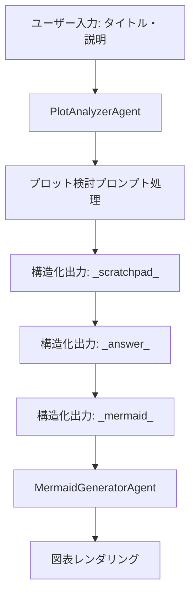
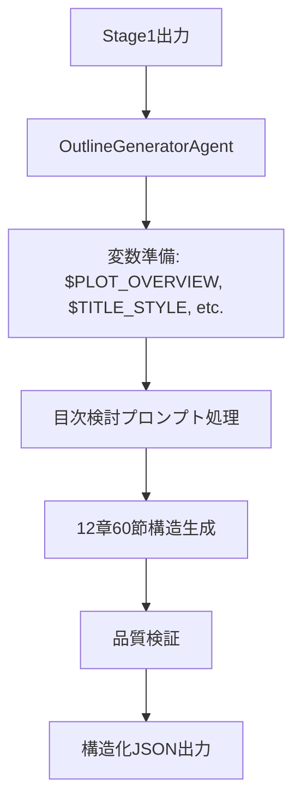

# プロンプト統合戦略 - 詳細検討

## 🎯 プロンプトファイル統合の課題と解決策

### 現状分析
◤◢◤◢◤◢◤◢◤◢◤◢◤◢◤◢◤◢◤◢◤◢◤◢◤◢◤◢
**課題の本質**:
1. 長文プロンプト（56-198行）の効率的管理
2. 動的変数置換機能の実装（$VARIABLE形式）
3. エージェント間での構造化データ受け渡し
4. LLM処理における品質とパフォーマンスの両立
5. CopilotKit/AG2/AG-UIの特性を活かした最適化
◤◢◤◢◤◢◤◢◤◢◤◢◤◢◤◢◤◢◤◢◤◢◤◢◤◢◤◢

## 🏗️ 統合アーキテクチャ設計

### 1. プロンプト管理レイヤー
```typescript
📁 src/prompts/
├── 📄 templates/
│   ├── plot-analysis.template.md
│   ├── outline-generation.template.md
│   └── novel-writing.template.md
├── 📄 processors/
│   ├── PromptProcessor.ts
│   ├── VariableReplacer.ts
│   └── OutputParser.ts
├── 📄 validators/
│   ├── InputValidator.ts
│   └── OutputValidator.ts
└── 📄 schemas/
    ├── plot-schema.json
    ├── outline-schema.json
    └── novel-schema.json
```

**PromptProcessor.ts 設計**:
```typescript
interface PromptProcessor {
  loadTemplate(templateName: string): Promise<string>
  replaceVariables(template: string, variables: Record<string, any>): string
  validateOutput(output: string, schema: string): boolean
  optimizeForLLM(prompt: string): string
}
```

### 2. エージェント統合レイヤー
```typescript
📁 src/agents/
├── 📄 base/
│   ├── BaseAgent.ts
│   └── AgentCommunicator.ts
├── 📄 specialized/
│   ├── PlotAnalyzerAgent.ts (プロット検討担当)
│   ├── OutlineGeneratorAgent.ts (目次検討担当)
│   ├── NovelWriterAgent.ts (小説執筆担当)
│   ├── MermaidGeneratorAgent.ts (図表生成担当)
│   └── QualityValidatorAgent.ts (品質検証担当)
└── 📄 coordination/
    ├── WorkflowOrchestrator.ts
    └── StateManager.ts
```

**AG2統合の設計ポイント**:
- **Conversable Agent Pattern**: 各エージェントが独立した対話能力を持つ
- **Human-in-the-loop**: 必要に応じてユーザー確認を挟む
- **Auto-reply Mechanism**: 自動応答とマニュアル介入のバランス
- **Code Execution**: プロンプト処理結果の自動検証

### 3. UI統合レイヤー (CopilotKit)
```typescript
📁 src/components/
├── 📄 copilot/
│   ├── NovelGenerationCopilot.tsx
│   ├── ProcessVisualization.tsx
│   └── AgentStatusPanel.tsx
├── 📄 chat/
│   ├── ConversationalInterface.tsx
│   └── PromptInputPanel.tsx
└── 📄 visualization/
    ├── AgentWorkflowChart.tsx
    ├── ProgressIndicator.tsx
    └── MermaidRenderer.tsx
```

**CopilotKit特性活用**:
- **@copilotkit/react-core**: エージェント状態管理
- **@copilotkit/react-ui**: 対話インターフェース
- **@copilotkit/react-textarea**: スマートテキスト入力

## 🔄 データフロー設計

### Stage 1: プロット分析フロー


**実装の技術的ポイント**:
- **変数置換**: `$USER_INPUT` → 実際のユーザー入力
- **出力パース**: _scratchpad_, _answer_, _mermaid_セクションの分離
- **Mermaid統合**: react-mermaidを使用したリアルタイム図表生成
- **AG-UI Protocol**: エージェント処理状況の可視化

### Stage 2: アウトライン生成フロー


**実装の技術的ポイント**:
- **複数変数管理**: 4つの変数($PLOT_OVERVIEW, $TITLE_STYLE, $STRUCTURE_GUIDE, $THEME)
- **大量テキスト処理**: 30,000-42,000語の生成管理
- **構造検証**: 12章×5節=60節の構造整合性チェック
- **メモリ最適化**: 大量データの効率的なメモリ管理

### Stage 3: 小説執筆フロー
```mermaid
graph TD
    A[Stage2出力] --> B[NovelWriterAgent]
    B --> C[執筆プロンプト適用]
    C --> D[節単位執筆 (5,000-7,000語/節)]
    D --> E[品質検証・文学性チェック]
    E --> F[一貫性検証]
    F --> G[最終出力]
```

**実装の技術的ポイント**:
- **分割処理**: 60節を段階的に生成
- **一貫性管理**: キャラクター・設定・文体の統一
- **品質制御**: 文学的品質の自動評価
- **進行管理**: リアルタイム進捗表示

## 🎛️ AG-UI Protocol統合

### プロトコル設計
```typescript
interface AgentMessage {
  type: 'status' | 'progress' | 'result' | 'error' | 'request_input'
  agentId: string
  content: any
  metadata: {
    stage: 'plot' | 'outline' | 'writing'
    progress: number
    timestamp: Date
  }
}

interface UserResponse {
  type: 'approval' | 'modification' | 'rejection'
  content: any
  feedback?: string
}
```

### UI可視化コンポーネント
```typescript
// エージェント連携の可視化
const AgentOrchestrationView: React.FC = () => {
  return (
    <div className="agent-workflow">
      <AgentNode agent="PlotAnalyzer" status={agentStates.plot} />
      <Arrow from="PlotAnalyzer" to="OutlineGenerator" />
      <AgentNode agent="OutlineGenerator" status={agentStates.outline} />
      <Arrow from="OutlineGenerator" to="NovelWriter" />
      <AgentNode agent="NovelWriter" status={agentStates.writing} />
    </div>
  )
}
```

## 🚀 実装優先順位

### Phase 1: コア機能実装
**期間**: 2週間  
**優先度**: 🔴 Critical
```
✅ プロンプトテンプレート外部化
✅ 変数置換エンジン実装
✅ 基本的なエージェント通信
✅ CopilotKit基本統合
```

### Phase 2: エージェント専門化  
**期間**: 3週間
**優先度**: 🔴 Critical
```
✅ PlotAnalyzerAgent (プロット分析)
✅ OutlineGeneratorAgent (アウトライン生成)  
✅ NovelWriterAgent (小説執筆)
✅ AG-UI Protocol統合
```

### Phase 3: 可視化・UX向上
**期間**: 2週間  
**優先度**: 🟡 High
```
✅ エージェント連携可視化
✅ リアルタイム進捗表示
✅ MermaidGeneratorAgent
✅ インタラクティブUI
```

### Phase 4: 品質・パフォーマンス
**期間**: 1週間
**優先度**: 🟢 Medium
```
✅ QualityValidatorAgent
✅ パフォーマンス最適化
✅ エラーハンドリング強化
✅ 包括的ログシステム
```

## 🔧 技術的実装詳細

### プロンプト最適化技術
```typescript
class PromptOptimizer {
  // 長文プロンプトの分割処理
  static chunkPrompt(prompt: string, maxTokens: number): string[] {
    // トークン数を考慮した最適な分割
  }
  
  // コンテキスト圧縮
  static compressContext(context: string): string {
    // 重要情報を保持しつつ圧縮
  }
  
  // 動的プロンプト調整
  static adaptPromptForLLM(prompt: string, modelCapabilities: object): string {
    // LLMの能力に応じたプロンプト調整
  }
}
```

### エージェント間通信最適化
```typescript
class AgentCommunication {
  // 非同期メッセージング
  async sendMessage(to: string, message: AgentMessage): Promise<void> {}
  
  // ブロードキャスト通信
  broadcast(message: AgentMessage, targets: string[]): void {}
  
  // 状態同期
  syncStates(agents: string[]): Promise<void> {}
}
```

## 📊 パフォーマンス考慮事項

### メモリ最適化
- **大量テキスト処理**: ストリーミング処理で メモリ使用量削減
- **キャッシュ戦略**: プロンプト結果の効率的キャッシュ
- **ガベージコレクション**: 適切なオブジェクト解放

### レスポンス最適化  
- **並列処理**: 独立タスクの並列実行
- **プリフェッチ**: 次段階プロンプトの事前準備
- **ストリーミング**: リアルタイム出力表示

### エラー耐性
- **Graceful Degradation**: 部分的失敗からの回復
- **Retry Logic**: 自動再試行メカニズム
- **Fallback Strategy**: 代替手段の提供

---

**作成日**: 2024-12-19  
**バージョン**: 1.0  
**更新予定**: 実装進捗に応じて随時更新 